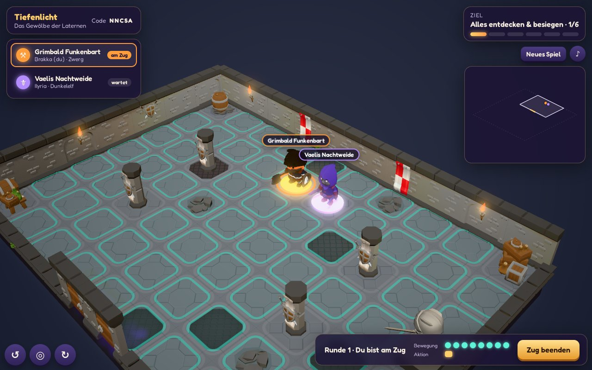
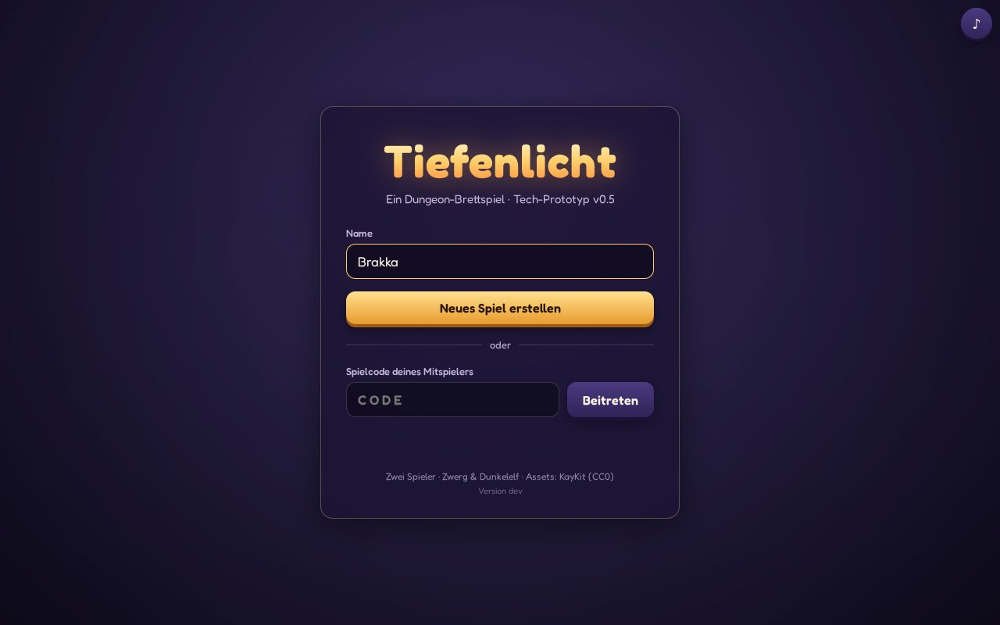
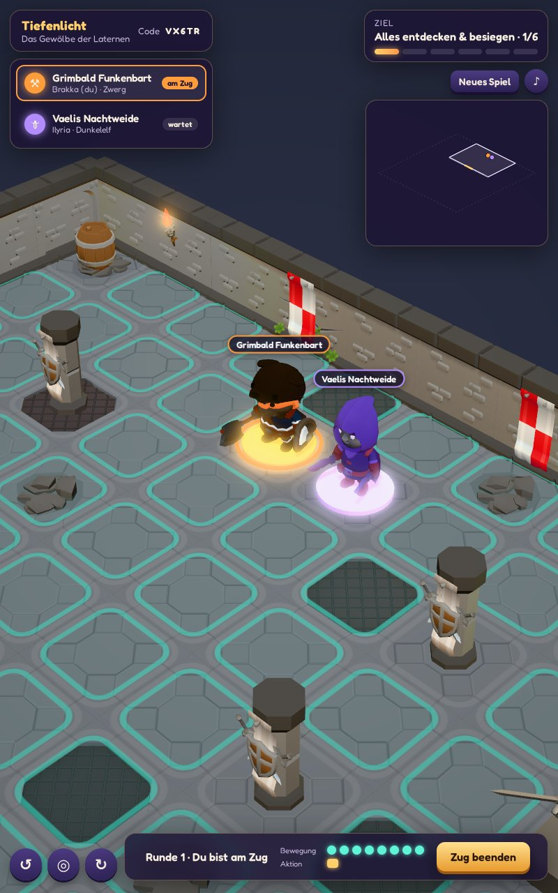
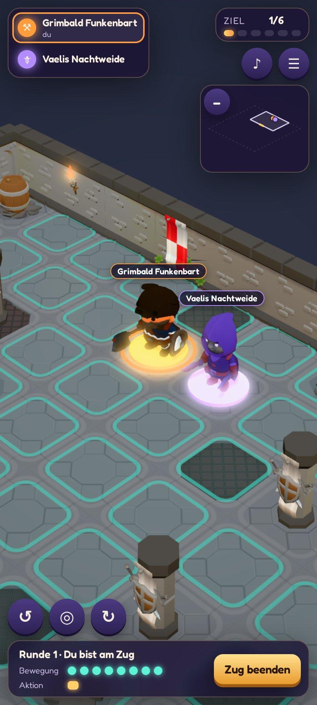

# Tiefenlicht

Ein rundenbasiertes 3D-Dungeon-Brettspiel für zwei Spieler, direkt im Browser. Ein Zwerg und
ein Dunkelelf erkunden gemeinsam „Das Gewölbe der Laternen“: drei Ebenen mit
Eingangshalle, Gang, Krypta und Magierstube, darunter die Gebeinkammer und darüber die
Sternwarte. Türen und Treppen führen in verborgene Räume, und dort erwachen Gegner.

**Online spielen:** <https://tiefenlicht.nieda.de>. Ein Spieler erstellt eine Partie, der
andere tritt per Code oder Link bei. Auf einem Android-Tablet lässt sich Tiefenlicht als App
installieren und läuft dann im Vollbild.

> Stand: Tech-Prototyp v0.5. Die Regeln sind bewusst schlank, siehe
> [Bekannte Grenzen](#bekannte-grenzen-v05).



## So spielt ihr

1. **Partie erstellen:** Namen eingeben und **Neues Spiel erstellen**. Du erhältst einen
   5-stelligen Code und einen Einladungslink.
2. **Beitreten:** Auf dem zweiten Gerät den Link öffnen oder den Code eingeben, dann
   **Beitreten**. Zwei Fenster oder Tabs auf demselben Gerät funktionieren ebenfalls.
3. **Abwechselnd ziehen:** Jeder Zug hat **8 Bewegungspunkte und 1 Aktion**.
   - Leuchtendes Feld antippen: Die Figur läuft hin. Der Pfad wird beim Überfahren
     angezeigt.
   - Steht der Held direkt an einer Tür, pulsiert sie golden. Ein Tipp öffnet sie (Aktion).
   - Treppen funktionieren wie Türen: Steht der Held vor einer Treppe oder an ihrem oberen
     Ende (beide Felder tragen eine goldene Bodenmarkierung), pulsiert sie golden. Ein Tipp
     erkundet sie (Aktion) und bringt den Held mit **einem** Schritt (1 BP) auf die andere
     Ebene. Ohne Bewegungspunkt bleibt er stehen. Erkundete Treppen kosten pro Durchgang
     1 BP. Unerkundete Treppen kündigen sich an: Aus der Tiefe steigt kalter Hauch, von oben
     fallen Sternenfunken.
   - Steht ein Gegner direkt neben dem Held (keine Wand oder geschlossene Tür dazwischen),
     trägt er einen roten Ring. Ein Tipp greift ihn an (Aktion), ein Schlag besiegt ihn.
   - **Zug beenden** per Button oder Leertaste.
4. **Gegnerphase:** Haben beide gezogen, laufen alle wachen Gegner bis zu 3 Felder auf den
   nächsten Helden zu. Sie greifen nicht an, versperren aber Wege und Türen.
5. **Ziel:** Alle sechs Bereiche entdecken **und alle Gegner besiegen**. Danach läuft das
   Spiel weiter, damit ihr euch in Ruhe umsehen könnt. **Neues Spiel** setzt die Partie
   jederzeit für beide zurück.

Ein Neuladen der Seite setzt das Spiel fort. Schließt ein Spieler den Tab, kann ein neuer
Tab über den Einladungslink den verwaisten Platz übernehmen. Die vollständigen Regeln stehen
in [`docs/game-mechanics.md`](docs/game-mechanics.md).

### Steuerung

**Tablet und Handy** (Hoch- und Querformat): Tippen wählt aus, ein Finger schwenkt die
Kamera, zwei Finger zoomen. Drehen und Held fokussieren liegen als Buttons unten links. Auf
kleinen Bildschirmen stecken Spielcode, Raster, Neues Spiel und FPS im Menü ☰, und die
Minimap ist einklappbar. Touch-Geräte rendern mit reduzierter Grafikqualität.

| Maus und Tastatur | |
|---|---|
| Linksklick | Laufen / Tür öffnen / Treppe erkunden oder nehmen / Gegner angreifen |
| Ziehen (links/rechts) oder WASD/Pfeiltasten | Kamera schwenken |
| Mausrad | Zoomen |
| Q / E | Ansicht um 90° drehen (Wände zur Kamera werden automatisch abgesenkt) |
| Bild↑ / Bild↓ | Ebene wechseln (auch über die Ebenen-Buttons der Minimap) |
| F | eigenen Helden fokussieren (inkl. seiner Ebene) |
| G | Raster ein/aus |
| M | Musik ein/aus (auch über den ♪-Button) |
| Leertaste | Zug beenden |

Die Kamera zeigt immer eine **Fokus-Ebene**. Sie folgt dem Helden am Zug und jeder
laufenden Figur, auch über Treppen, und blendet beim Wechsel kurz den Namen der Ebene ein.
Ebenen darüber sind ausgeblendet, Ebenen darunter abgedunkelt und mit abgesenkten Wänden
sichtbar. Die **Minimap** rechts oben zeigt alle entdeckten Ebenen als gestapeltes
Drahtgittermodell mit Türen, Treppen und Figuren und dreht mit der Kamera mit.

Die **Hintergrundmusik** ist ein eigenes Chiptune im Amiga/NES-Stil, das zur Laufzeit per
WebAudio entsteht. Sie startet mit der ersten Eingabe (Autoplay-Regel der Browser). Ob sie
an oder aus ist, merkt sich der Browser.

| Startbildschirm | Tablet hochkant | Handy |
|---|---|---|
|  |  |  |

## Als App installieren

Tiefenlicht ist eine Progressive Web App. Installiert startet es vom Startbildschirm, ohne
Adressleiste und auf Android im Vollbild.

- **Android (Chrome):** <https://tiefenlicht.nieda.de> öffnen und auf dem Startbildschirm
  **Als App installieren** antippen. Erscheint der Knopf nicht, geht es über das
  Chrome-Menü ⋮ → **App installieren** (oder „Zum Startbildschirm hinzufügen“).
- **iPad/iPhone (Safari):** Teilen → **Zum Home-Bildschirm**. iOS zeigt die App ohne
  Browserleiste, aber mit Statusleiste.

**Updates** kommen von selbst. Die App sucht beim Start, alle 30 Minuten und bei jeder
Rückkehr in den Vordergrund nach einer neuen Version. Gewechselt wird nur auf dem
Startbildschirm, nie mitten in einer Partie. Welche Version läuft, steht unten auf dem
Startbildschirm.

Gespielt wird immer online, denn der Server führt die Partie. Die App speichert nur die
Programmdateien und die 3D-Modelle, damit sie schneller startet.

## Selbst betreiben und entwickeln

### Docker

```bash
docker compose up -d --build        # http://localhost:8080
PORT=8090 docker compose up -d      # anderer Host-Port
```

Ein Container liefert Client und WebSocket-Server auf demselben Port aus. Das produktive
Deployment beschreibt [`DEPLOY.md`](DEPLOY.md).

### Lokale Entwicklung

Voraussetzungen: Node.js ≥ 24, pnpm über corepack (`corepack enable pnpm`).

```bash
pnpm install
pnpm dev          # Vite-Client http://localhost:5173 + Game-Server :8080 (Hot Reload)
pnpm test         # Vitest: Regeln, Validator, Protokoll, Server-Sitzungen
pnpm typecheck    # TypeScript in allen Paketen
pnpm build        # Client-Build (Vite) + Server-Bundle (esbuild)
pnpm start        # gebauten Server inkl. Client auf http://localhost:8080 starten
```

Im Dev-Modus verwirft `tsx watch` bei jeder Serveränderung alle In-Memory-Spiele. Offene
Clients kehren dann automatisch in die Lobby zurück. Der Service Worker ist nur im Build
aktiv (`pnpm build && pnpm start`), nicht unter `pnpm dev`.

### Screenshots und Icons neu erzeugen

Beide Skripte nutzen Playwright mit Chromium (`pnpm exec playwright install chromium`, falls
noch kein Browser vorhanden ist).

```bash
pnpm build && pnpm start              # Server auf :8080
node scripts/screenshots.mjs          # -> docs/screenshots/*.jpg (dauert einige Minuten)
node scripts/icons.mjs                # assets/icons/icon.svg -> PNG-Icons
```

Das Screenshot-Skript spielt pro Gerät mit zwei Browser-Kontexten: einer erstellt die
Partie, der andere tritt bei. Gerendert wird per Software (SwiftShader), daher nur mit
wenigen FPS.

## Architektur

```text
apps/
  client/       Babylon.js 9 + Vite: Szene, Kamera, Rendering, Animation, HTML-HUD, PWA
  server/       Node.js + ws: Lobby, Sitzungen/Token, autoritativer Spielablauf
packages/
  shared/       Typen, WebSocket-Protokoll, Eingabevalidierung, Konstanten
  game-core/    Regeln ohne Rendering-Abhängigkeit: Board, Bewegung (BFS),
                Türen, Sichtbarkeit/Fog-of-War-Filter, Zugfolge, Kartenvalidator
                content/  Karte als JSON (nur Server, per Export-Condition "node")
assets/         Modelle (KayKit, CC0), Lizenzen und App-Icons; wird vom Client als public/ ausgeliefert
docs/           Mechanik-Entscheidungen, Reviews und Screenshots
scripts/        Screenshots und Icons (Playwright)
```

- **Autoritativer Server:** Der Client sendet nur Absichten (`MOVE_CHARACTER` mit Zielfeld,
  `OPEN_DOOR`, `END_TURN`, `RESTART_GAME`). Der Server prüft sie mit `game-core`, berechnet
  z. B. den Pfad selbst und sendet Ereignisse plus neuen Zustand an beide Clients. Die
  Clients animieren nur.
- **Fog of War serverseitig:** Clients erhalten nur entdeckte Bereiche. Verborgene Räume,
  Props und Monster stehen weder im Netzwerkverkehr noch im Client-Bundle.
- **Datengetriebener Dungeon:** Die Karte beschreibt Bereiche, Türen auf Kanten, Props,
  Wanddeko, Monster, Starts, Siegbedingung und Regelparameter. Wände werden abgeleitet.
  `validateDungeon` prüft Form und Spielbarkeit und ist damit als Editor-Validierung
  wiederverwendbar.
- **Themes:** Die Geometrie ist unabhängig von der Optik. Halle, Gang, Krypta und
  Magierstube unterscheiden sich nur über Theme-Stile (Boden, Wände, Flammenfarbe, Nebel,
  Funken).
- **PWA:** `vite-plugin-pwa` erzeugt Manifest und Service Worker. Vorab gecacht wird nur die
  Hülle (JS, CSS, HTML, Icons). Modelle und Texturen landen beim ersten Laden in einem
  Cache, dessen Name einen Inhalts-Hash trägt. `/ws` und `/healthz` gehen immer an den
  Server. Registrierung und Update-Logik: `apps/client/src/pwa/`. Die Version kommt aus
  `APP_VERSION` (Docker-Build-Argument, siehe `bin/release.sh`).

## Assets und Lizenzen

Der Code steht unter der [MIT-Lizenz](LICENSE).

Alle 3D-Modelle stammen von **Kay Lousberg (KayKit)** und stehen unter **CC0**:
Dungeon Remastered, Character Pack Adventurers, Character Pack Skeletons. Die
Lizenzdateien liegen in `assets/licenses/`. KayKit ersetzt die im Konzept bevorzugten
Quaternius-Pakete. Gründe: KayKit liefert Dungeon, Helden und Skelette in einem
einheitlichen Stil, die Figuren sind animiert (Laufen, Interagieren, Erwachen, Jubeln),
und die Pakete sind direkt per Git beziehbar. Sarkophag, Bücherregale, Kessel, Kristall
und Statue-Sockel sind prozedural erzeugt. Font: Fredoka (SIL OFL).

## Bekannte Grenzen v0.5

- Kampf nur als Ein-Schlag-Angriff der Helden; keine Würfel, kein Inventar, keine
  Lebenspunkte. Gegner nähern sich nur an und greifen nicht an.
- Spiele liegen nur im Speicher. Ein Server-Neustart oder Release beendet alle Partien.
- Es fehlen ein Limit für die Spielerstellung pro IP und längere Spielcodes.
- Grafik: WebGL2 mit Schatten, Glow, Bloom und Partikeln. Auf Rechnern ohne
  GPU-Beschleunigung läuft die Szene nur mit wenigen FPS.
